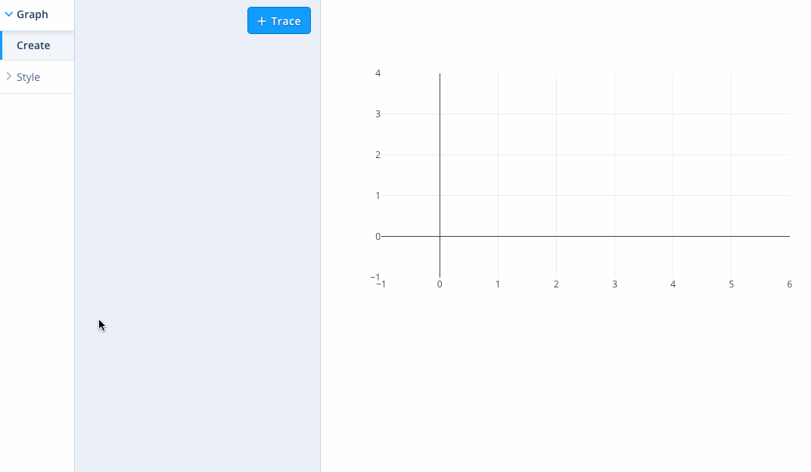
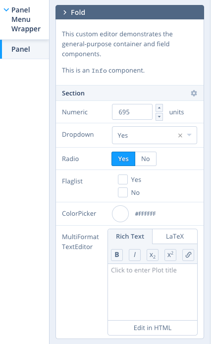

# react-chart-editor

> React component for creating & editing D3 charts. [Sponsor an addition to this project](https://plot.ly/products/consulting-and-oem/)


## Demo & Screenshots

Check out the [live demo here](https://plotly.github.io/react-chart-editor/).



## Quick start

Check out the demo of the latest release of the `DefaultEditor` at https://plotly.github.io/react-chart-editor/ or run it locally with:

```
git clone [this repo]
cd react-chart-editor
cd examples/demo
npm install
npm start
```

See more examples
[here](https://github.com/plotly/react-chart-editor/tree/master/examples).

## Overview

This module's entry point is a React component called `<PlotlyEditor />` which connects an instance of `<EditorControls />` to a [plotly.js](https://plot.ly/javascript/)-powered `<Plot />` component care of [`react-plotly.js`](https://github.com/plotly/react-plotly.js). `<PlotlyEditor />` accepts as children React components whose descendents are input elements wrapped via `connectToContainer()` calls so as to bind them to the `<Plot />`'s figure's values. If no children are passed to the `<PlotlyEditor />`, the `<DefaultEditor />` is used. This module also exposes the [building block components](#Built-in-Components) that comprise the `<DefaultEditor />` so that developers can create their own customized editors.

## Styling the `<DefaultEditor />` and the built-in components

* Import editor styles with `import 'react-chart-editor/lib/react-chart-editor.min.css'`
* Interested in [theming](https://github.com/plotly/react-chart-editor/tree/master/THEMING.md)?
* Need to support IE11? import the IE css instead: `import 'react-chart-editor/lib/react-chart-editor.ie.min.css'`

## Development Setup

This repo contains a [dev app](https://github.com/plotly/react-chart-editor/tree/master/dev) that depends on the components locally and is configured for hot reloading, for easy local development. A `jest`-based test suite is also included.

```
cp accessTokens.tpl.js accessTokens.js # and edit to taste
npm install
npm start
# hacking happens here
npm test
```

## Built-in Components

This module provides a number of nestable _containers_ which are intended to contain _fields_ that render _widgets_ that have been connected to individual values in the figure via _connector functions_. Containers can also be connected to parts of the figure tree (e.g. `layout` or specific traces in `data`) such that their child fields map to the appropriate leaf values. A field must have a connected container as an ancestor in order to be bound to the figure. The `<PlotlyEditor />` and connector functions use the React [`context` API](https://reactjs.org/docs/legacy-context.html) to push configuration information to child components.

At a pseudo-code level it looks like this:

```javascript
<PlotlyEditor {...etc}>
  <ConnectedContainer {...etc}>
    <Field attr="path.to.figure.value" {...etc} />
  </ConnectedContainer>
</PlotlyEditor>
```

The [custom editor example](https://github.com/plotly/react-chart-editor/tree/master/examples/custom) shows how to build a custom editor, and shows off all of the general-purpose containers and fields listed below.

### General-purpose Containers

* `<PanelMenuWrapper />`: renders as a sidebar selector menu for `<Panel />`s
* `<PlotlyPanel />`: renders as a generic rectangular container with special handling for collapsing/expanding child `<Fold />`s and optionally an 'add' button for creating them, has special [visibility rules](https://github.com/plotly/react-chart-editor/tree/master/src/components/containers/__tests__/ConnectedContainersVisibility-test.js) that depend on plotly figure
* `<PlotlyFold />`: collapsable container within a `<Panel />`, has special [visibility rules](https://github.com/plotly/react-chart-editor/tree/master/src/components/containers/__tests__/ConnectedContainersVisibility-test.js) that depend on plotly figure
* `<PlotlySection />`: uncollapsable container within a `<Panel />` or `<Fold />`, has special [visibility rules](https://github.com/plotly/react-chart-editor/tree/master/src/components/containers/__tests__/ConnectedContainersVisibility-test.js) that depend on plotly figure
* `<Panel/>`, `<Fold/>`, `<Section/>`: same as `PlotlyPanel`, `PlotlyFold`, `PlotlySection`, but there are no special visibility rules, those containers [always show, and always show their children](https://github.com/plotly/react-chart-editor/tree/master/src/components/containers/__tests__/UnconnectedContainersVisibility-test.js), but Fold does not have the canDelete functionality as its context related
* `<SingleSidebarItem/>`: wraps any item you would like to see appear in the sidebar menu.

### General-purpose Fields

All Fields except `<Info />` accept an `attr` property to bind them to a key in the figure (see https://plot.ly/javascript/reference/ for exhaustive documentation of figure keys). This property can be a `.`-delimited path to a leaf, starting at the context-appropriate point in the figure for the parent container (see connector functions below).

* `<Info />`: renders its children as HTML, useful for displaying help text
* `<Numeric />`: renders as a text field with arrows and units, useful for numeric values
* `<Radio />`: renders as a button group, useful for mutually-exclusive low-cardinality enumerable values
* `<Dropdown />`: renders as a dropdown menu useful for mutually-exclusive high-cardinality enumerable values
* `<Dropzone/>`: renders a dropzone component to drag and drop files to load
* `<ColorPicker />`: renders as a popup color-picker, useful for CSS color hex value strings
* `<ColorscalePicker />`: npm module [react-colorscales](https://github.com/plotly/react-colorscales)
* `<Flaglist />`: renders as a list of checkboxes, useful for `+`-joined flag lists like `data[].mode`
* `<TextEditor />`: renders as a WYSIWYG editor, useful for text like `layout.title`, takes props: `latexOnly`, `richTextOnly`, `htmlOnly` if no format props given, defaults to the `MultiFormat` text editor (latex && richText && html)

<p align="center">
  
</p>

### Widgets

Simple component that takes in props and renders.

* `<Button/>`: simple button component, useful when combined with `<SingleSidebarItem/>` to add as menu item

### Special-Purpose Containers

* `<TraceAccordion />`: `<Panel />` whose children are replicated into `<Folds />` connected to traces via `connectTraceToPlot()`.
* `<LayoutPanel />`: `<Panel />` whose children are connected to the `layout` figure key
* `<LayoutSection />`: `<Section />` whose children are connected to the `layout` figure key
* `<TraceRequiredPanel />`: `<LayoutPanel />` renders `<PanelEmpty />` if no trace data is set, can add extra conditions (i.e. an array of functions that will be run) with the `extraConditions` prop and a matching array with extraEmptyPanelMessages to show when those conditions are not met.
* `<AnnotationAccordion />`: `<Panel />` whose children are replicated into `<Folds />` connected to annotations via `connectAnnotationToLayout()`. For use in a `<LayoutPanel />`.
* `<ShapeAccordion />`: `<Panel />` whose children are replicated into `<Folds />` connected to shapes via `connectShapeToLayout()`. For use in a `<LayoutPanel />`.
* `<ImageAccordion />`: `<Panel />` whose children are replicated into `<Folds />` connected to images via `connectImageToLayout()`. For use in a `<LayoutPanel />`.
* `<AxesFold />`: `<Fold />` whose children are bound to axis-specific keys. For use in a `<LayoutPanel />`; and automatically contains an `<AxesSelector />` (see below).
* `<TraceMarkerSection />`: `<Section />` with trace-specific name handling. For use in containers bound to traces e.g. as children of `<TraceAccordion />`.

### Special-Purpose Fields

For use in containers bound to traces e.g. as children of `<TraceAccordion />`:

* `<DataSelector />`: renders as a `<Dropdown />` coupled to `data[].*src` etc, triggers `onUpdateTraces` when changed
* `<TraceSelector />`: renders as a `<Dropdown />` useful for `data[].type`
* `<LineDashSelector />`: renders as a `<Dropdown />` useful for `data[].line.dash`
* `<LineShapeSelector />`: renders as a `<Dropdown />` useful for `data[].line.shape`
* `<SymbolSelector />`: renders as a `<Dropdown />` useful for `data[].marker.symbol`
* `<PositioningRef />`: renders as a `<Dropdown />` useful for `layout.*.xref/yref` where the allowable values are `paper|[axis]`
* `<ErrorBars/>`: renders a set of controls that control a trace's error bars (`visibility`, `type`, `value`, `valueminus`, `array`, `arrayminus`)

For use in containers bound to layout:

* `<FontSelector />`: renders as a `<Dropdown />` whose options are rendered in the selected font
* `<CanvasSize />`: renders as a `<Numeric />` with visibility coupled to `layout.autosize`

For use in containers bound to axes:

* `<AxesSelector />`: renders as a `<Radio />` to select one or all axes. Must be in a container bound to a figure via `connectAxesToPlot()` and sets that container's context such that its children are bound to either all axes or just the selected one. `<AxesFold>`s automatically contain this component.
* `<AxesRange />`: numeric with visibility coupled to `layout.*axis.autorange`

For use in containers bound to annotations e.g. as children of `<AnnotationAccordion />`:

* `<AnnotationRef />`: renders as a `<Dropdown />` useful for `layout.annotations[].xref`, `layout.annotations[].yref`
* `<AnnotationArrowRef />`: renders as a `<Dropdown />` useful for `layout.annotations[].axref`, `layout.annotations[].ayref`
* `<ArrowSelector />`: renders as a `<Dropdown />` useful for `layout.annotations[].arrowhead`

### Connector functions

* `connectToContainer( Component )`: returns a field component that can be bound to a figure value via the `attr` prop.
* `connectTraceToPlot( Container )`: returns a wrapped container component that can be bound to a figure trace such that its children are bound to that trace's figure entry under the `data` key, e.g. `<TraceAccordion />` above.
* `connectLayoutToPlot( Container )`: returns a wrapped container component that can be bound to a figure such that its children are bound to that figure's layout under the `layout` key.
* `connectAxesToLayout( Container )`: returns a wrapped container component that should contain an `<AxesSelector />` field (see above) and can be bound to a figure such that its children are bound to that figure's axes entries under the `layout.*axis` keys.
* `connectAnnotationToLayout( Container )`: returns a wrapped container component that can be bound to a figure annotation such that its children are bound to that annotation's figure entry under the `layout.annotations` key, e.g. the `<Fold>`s in `<AnnotationAccordion />` above.
* `connectShapeToLayout( Container )`: returns a wrapped container component that can be bound to a shape such that its children are bound to that shape's figure entry under the `layout.shapes` key, e.g. the `<Fold>`s in `<ShapeAccordion />` above.
* `connectImagesToLayout( Container )`: returns a wrapped container component that can be bound to an image such that its children are bound to that image's figure entry under the `layout.image` key, e.g. the `<Fold>`s in `<ImageAccordion />` above.

## Mapbox Access Tokens

To use Satellite Maps in the Editor, [Mapbox access tokens](https://www.mapbox.com/help/how-access-tokens-work/) are required.

Once you have your tokens, you can provide it as a config prop to the `<PlotlyEditor />` component: `<PlotlyEditor config={{mapboxAccessToken: 'your token'}}/>`

## See also

* [plotly.js](https://github.com/plotly/plotly.js)
* [react-plotly.js](https://github.com/plotly/react-plotly.js)

## License

&copy; 2019 Plotly, Inc. MIT License.

## Sponsors

This work was made possible by [Alteryx](https://www.alteryx.com/), a leader in self-serve data analytics and data blending.


